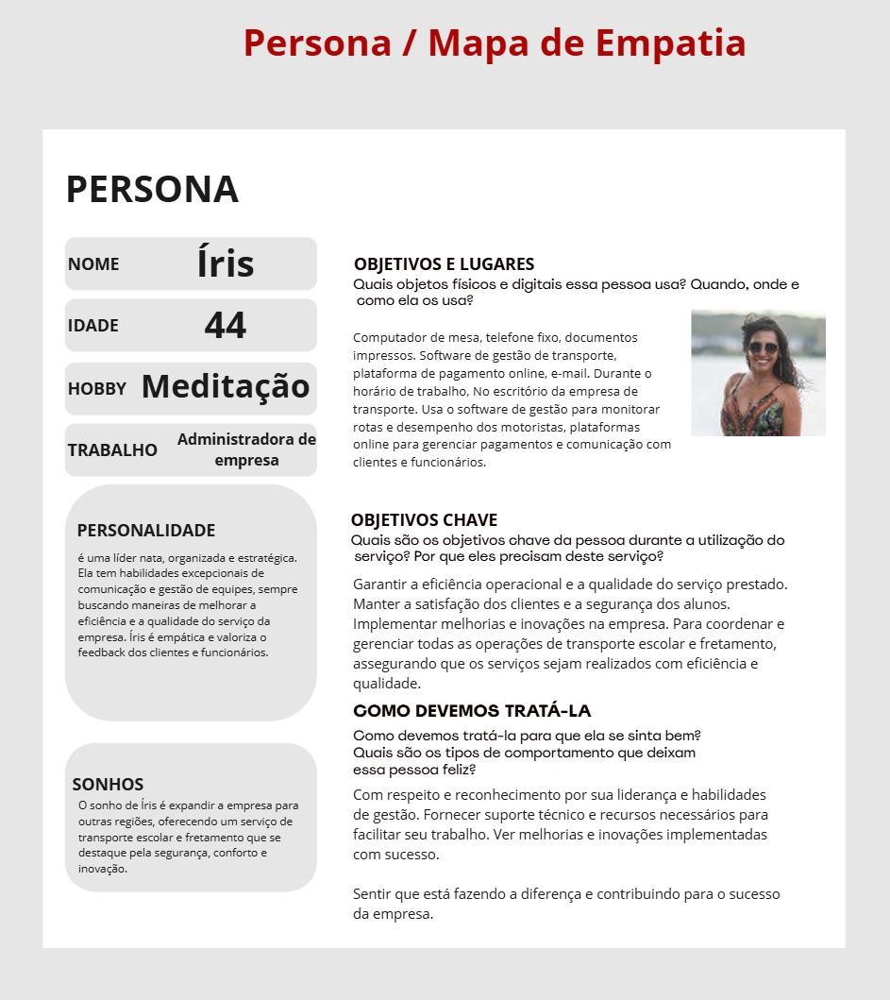
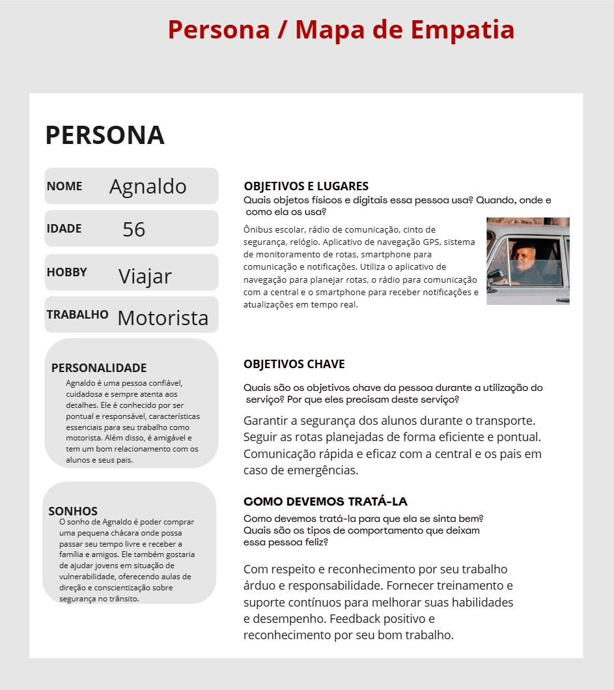
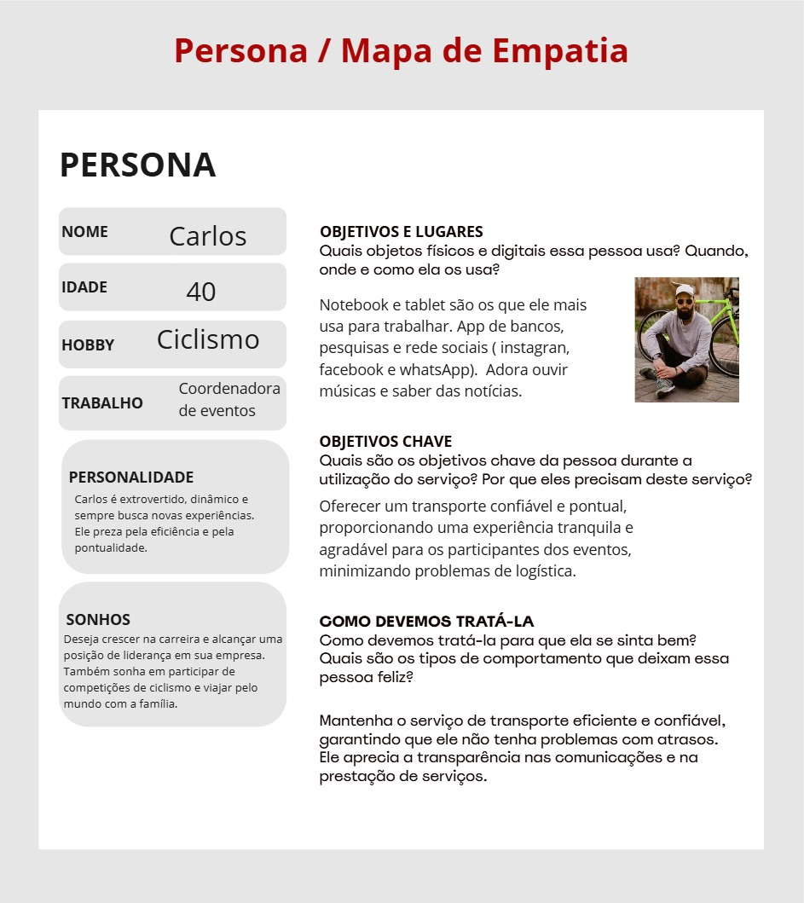
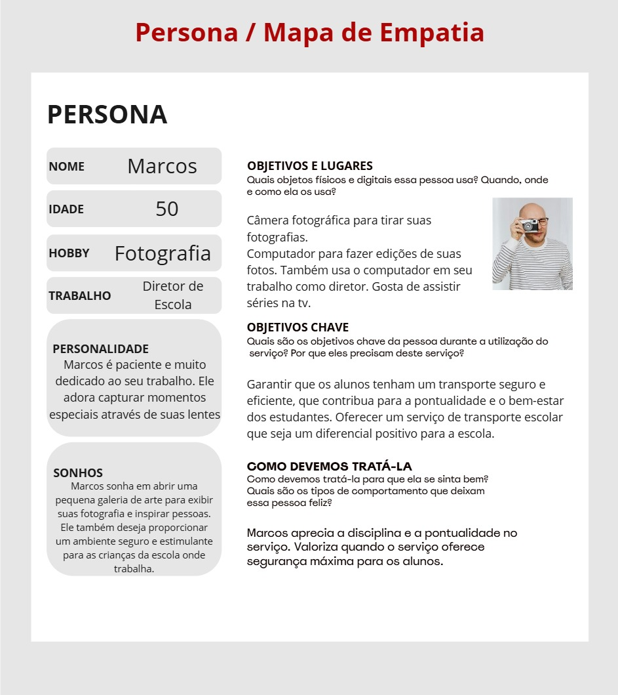
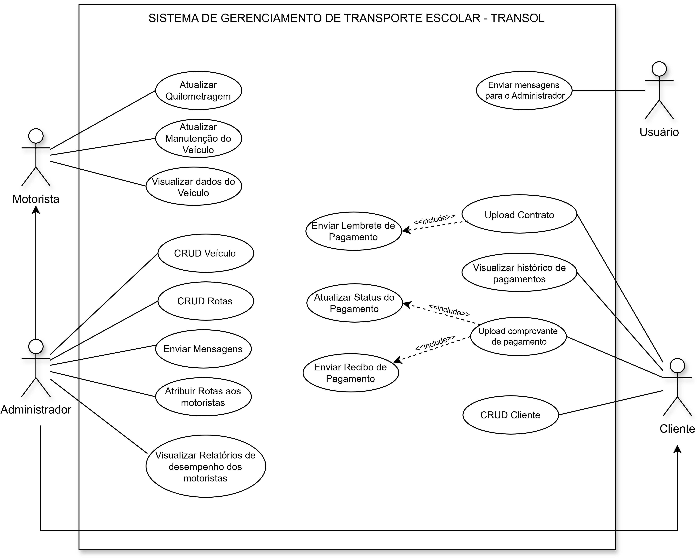

# Especificação do projeto

Pré-requisitos: <a href="01-Contexto.md"> Documentação de contexto</a>

## Personas

## Histórias de usuários

Com base na análise das personas, foram identificadas as seguintes histórias de usuários:

|EU COMO... `PERSONA`| QUERO/PRECISO ... `FUNCIONALIDADE` |PARA ... `MOTIVO/VALOR`                 |
|--------------------|------------------------------------|----------------------------------------|
|Eu, Íris, como administradora de empresa de transporte escolar e fretamento,|preciso monitorar a localização em tempo real dos ônibus escolares, receber relatórios detalhados sobre o desempenho dos motoristas e a utilização dos veículos,|para monitorar a eficiência operacional e identificar áreas de melhoria e garantir a segurança dos alunos e planejar melhor os horários de entrada e saída.|
|Eu, Agnaldo como motorista de ônibus escolar e fretamento,|preciso ter acesso a rotas otimizadas e atualizações de tráfego em tempo real|para garantir que chegue aos destinos de forma rápida e segura, evitando atrasos.|
|Eu, Renata, como gerente financeira da empresa de transporte escolar,| preciso acompanhar em tempo real os pagamentos realizados e emitir relatórios financeiros mensais|para manter o controle das receitas, identificar inadimplências e tomar decisões estratégicas com base em dados confiáveis.|
Eu, Thiago, como supervisor de operações,|preciso analisar indicadores de desempenho das rotas e da pontualidade dos motoristas,|para otimizar a logística, reduzir custos com combustível e manutenção, e melhorar a eficiência do serviço.
|Eu, Sofia, mãe de um aluno, | quero receber notificações em tempo real sobre a localização do Escolar| para garantir que meu filho está seguro e saber o horário de chegada e partida.|
|Eu, Carlos, coordenador de vendas, |quero comunicar mudanças de última hora nas rotas de ônibus | para ajustar rapidamente a logística de transporte e informar os participantes.  |
|Eu, Marcos, diretor de escola,|quero acompanhar em tempo real a localização dos ônibus escolares|para garantir a segurança dos alunos e planejar melhor os horários de entrada e saída.|
|Eu, Mariana, professora,|quero ter um canal de comunicação com os pais sobre o transporte escolar| para informar sobre alterações nos horários e garantir que os pais estejam cientes.
| Eu, Fernanda, como avó responsável pelo neto | quero acompanhar em tempo real a localização do transporte | para ter segurança de que meu neto está no trajeto correto e saber o horário de chegada em casa. |
| Eu, Ricardo, como cliente de fretamento ocasional | preciso solicitar uma viagem diretamente pelo sistema | para ter comodidade na contratação sem precisar de ligações ou mensagens informais. |
| Eu, Vanessa, como mãe de dois alunos | quero cadastrar ambos os filhos no mesmo contrato | para facilitar o controle dos pagamentos e da logística familiar. |
| Eu, Cláudia, como tia responsável eventualmente pelos sobrinhos | preciso ser notificada sobre atrasos ou alterações na rota | para garantir que estarei no local certo na hora de recebê-los ou entregá-los. |
| Eu, Roberto, como cliente de fretamento para eventos | quero gerar um orçamento online de uma viagem | para avaliar rapidamente o custo sem precisar entrar em contato manualmente com a administração. |
| Eu, Juliana, como mãe | quero ter acesso a um chat com o motorista durante o trajeto | para esclarecer dúvidas ou comunicar situações específicas, como mudança no ponto de embarque. |
| Eu, Felipe, como pai | quero visualizar o histórico de pagamentos realizados | para manter meu controle financeiro organizado e evitar esquecimentos de mensalidades. |
| Eu, André, como motorista | quero visualizar facilmente a lista dos alunos de cada rota | para garantir que todos foram embarcados e desembarcados corretamente, evitando esquecimentos ou erros. |

## Requisitos

### Requisitos funcionais

|ID    | Descrição do Requisito  | Prioridade |
|------|-----------------------------------------|----|
|RF-001| O sistema deve permitir login de administrador  | ALTA | 
|RF-002| O sistema deve permitir login de cliente | ALTA |
|RF-003| O sistema deve permitir login de motorista | ALTA |
|RF-004| O administrador deve fazer o cadastro do cliente | ALTA |
|RF-005| O administrador deve ser capaz de editar os dados do cliente | ALTA |
|RF-006| O administrador deve ser capaz de excluir o cliente | ALTA |
|RF-007| O administrador deve ser capaz de visualizar todos os dados do cliente | ALTA |
|RF-008| O cliente deve ser capaz de enviar o recibo do pagamento  | ALTA |
|RF-009| O cliente e o administrador devem ser capazes de visualizar todos os pagamentos feitos | ALTA |
|RF-010| O cliente deve ser capaz de enviar mensagens para o administrador| ALTA |
|RF-011| O sistema deve enviar mensagens com lembrete de pagamento ao cliente | ALTA |
|RF-012| O sistema deve alterar o status do pagamento da mensalidade após o envio do comprovante | ALTA |
|RF-013| O administrador deve ser capaz de cadastrar veículos | ALTA |
|RF-014| O administrador deve ser capaz de editar os dados dos veículos | ALTA |
|RF-015| O administrador deve ser capaz de excluir os veículos | ALTA |
|RF-016| O administrador deve ser capaz de cadastrar motoristas  | ALTA |
|RF-017| O administrador deve ser capaz de editar os dados dos motoristas | ALTA |
|RF-018| O administrador deve ser capaz de excluir os motoristas | ALTA |
|RF-019| O motorista deve ser capaz de atualizar a quilometragem do veículo  | MEDIA |
|RF-020| O motorista e o administrador devem ser capazes de atualizar dados de manutenção dos veículos | MEDIA |
|RF-021| O motorista deve ser capaz de visualizar os dados dos veículos | MEDIA | 
|RF-022| O administrador deve ser capaz de criar uma rota diária para cada motorista | ALTA |
|RF-023| O administrador e o motorista devem ser capazes de visualizar as rotas criadas | MEDIA |
|RF-024| O sistema deve permitir a recuperação de senha do usuário | ALTA |
|RF-025| O sistema deve permitir a alteração de senha por parte do usuário | ALTA |
|RF-026| O sistema deve permitir a geração de relatórios financeiros | BAIXA |
|RF-027| O sistema deve permitir a exportação de dados | BAIXA |
|RF-028| O sistema deve permitir a criação de múltiplos administradores | BAIXA |
|RF-029| O sistema deve registrar o histórico de ações realizadas pelos administradores e motoristas | ALTA |
|RF-030| O sistema deve permitir a atribuição de tarefas ou atividades para os motoristas | ALTA |
|RF-031| O sistema deve permitir a visualização de relatórios de desempenho de motoristas | ALTA |
|RF-032| O sistema deve mudar o status do pagamento depois do envio do recibo |  ALTA |

### Requisitos não funcionais

|ID     | Descrição do Requisito  |Prioridade |
|-------|-------------------------|----|
|RNF-001| O sistema deve funcionar 24/7  | ALTA | 
|RNF-002| O sistema deve ser capaz de processar até 300 usuários simultâneos sem degradação de desempenho. |ALTA |
|RNF-003| O tempo de resposta para cada operação (login, cadastro, consulta) não deve ultrapassar 10 segundos. | MÉDIA |
|RNF-004| O sistema deve ser escalável para suportar o aumento de número de usuários e transações. | ALTA |
|RNF-005| O sistema deve utilizar criptografia para proteger dados sensíveis, como senhas de usuários e informações de pagamento. | ALTA |
|RNF-006| O sistema deve ter uma interface intuitiva e fácil de usar para todos os tipos de usuário. | ALTA |
|RNF-007|O sistema deve ser acessível em dispositivos móveis e desktops. | ALTA |
|RNF-008|O código do sistema deve seguir boas práticas de desenvolvimento e ser bem documentado, para facilitar futuras manutenções e atualizações. | ALTA |
|RNF-009|O sistema deve permitir atualizações automáticas sem a necessidade de interrupção significativa dos serviços. | ALTA |
|RNF-010| O sistema deve ser compatível com as versões mais recentes dos principais navegadores | ALTA |
|RNF-011| O sistema deve ser compatível com sistemas operacionais amplamente utilizados, como Windows, Linux e macOS. | ALTA |
|RNF-012| O sistema deve realizar backups automáticos regulares (diários ou semanais), com a capacidade de restaurar dados em caso de falha. | MEDIA |
|RNF-013| O sistema deve ser capaz de recuperar dados de transações realizadas, mesmo em caso de falhas técnicas. | ALTA |
|RNF-014| O sistema deve estar em conformidade com a Lei Geral de Proteção de Dados (LGPD) e outras regulamentações de privacidade de dados aplicáveis. | ALTA |

## Restrições

O projeto está restrito aos itens apresentados na tabela a seguir.

|ID| Restrição                                             |
|--|-------------------------------------------------------|
|001| A capacidade dos veículos deve ser adequada ao número de alunos e passageiros, respeitando as normas de segurança e conforto. |
|002| Todos os motoristas devem seguir as leis de trânsito e regulamentações específicas para transporte escolar, incluindo limites de velocidade e sinalização.|
|003| A empresa deve garantir uma conexão de internet estável e segura para o funcionamento dos sistemas de monitoramento e comunicação.|
|004| Os sistemas devem ser compatíveis com diversos dispositivos e sistemas operacionais utilizados por motoristas, administradores, pais e escolas.|
|005| A empresa deve cumprir as leis de proteção de dados pessoais, garantindo a privacidade e segurança das informações dos usuários.|
|006| Todos os veículos e motoristas devem possuir as licenças e certificações necessárias para a operação de serviços de transporte escolar e fretamento.|
|007| A empresa deve gerenciar os custos operacionais para garantir a viabilidade econômica dos serviços oferecidos.|

## Diagrama de casos de uso

 

 Principais casos de uso:
   [Administrador, Cliente, Motorista] → Realizar login
   
   [Administrador] → Cadastrar cliente
   
   [Administrador] → Editar dados do cliente
   
   [Administrador] → Excluir cliente
   
   [Administrador] → Visualizar dados do cliente
   
   [Cliente] → Enviar mensagem para administrador
   
   [Sistema] → Enviar lembrete de pagamento
   
   [Administrador] → Responder mensagens
   
   [Cliente] → Enviar recibo de pagamento
   
   [Cliente, Administrador] → Visualizar pagamentos
   
   [Sistema] → Atualizar status do pagamento
   
   [Administrador] → Cadastrar veículo
   
   [Administrador] → Editar dados do veículo
   
   [Administrador] → Excluir veículo
   
   [Motorista] → Visualizar dados do veículo
   
   [Motorista] → Atualizar quilometragem
   
   [Motorista, Administrador] → Atualizar manutenção
   
   [Administrador] → Atribuir tarefas ao motorista
   
   [Administrador] → Ver relatórios de desempenho
   
   [Administrador, Motorista] → Visualizar rotas
   
