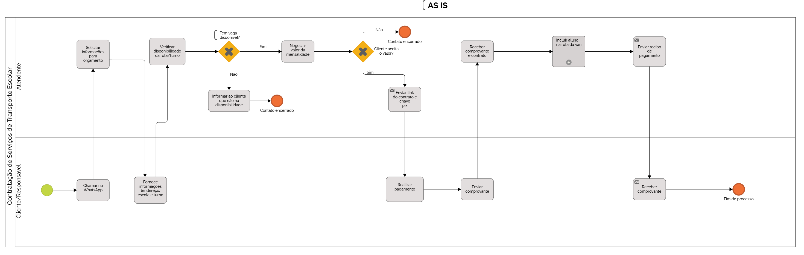
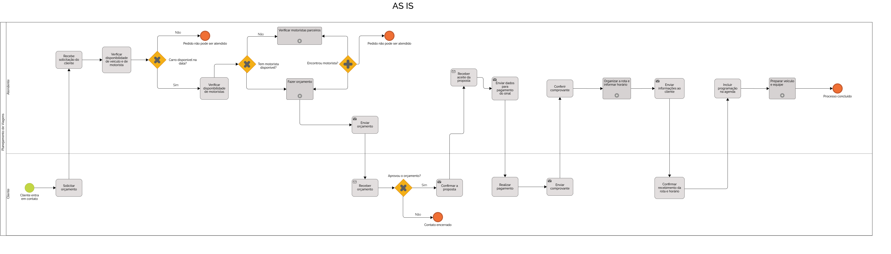
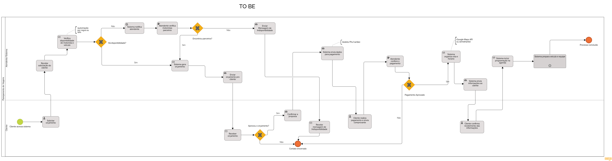

# Modelagem dos processos de negócio

Pré-requisitos: <a href="02-Especificacao.md"> Especificação do projeto</a>

## Modelagem da situação atual (Modelagem AS-IS)

  Atualmente, a Transol, ainda utiliza processos manuais e sistemas desconectados para gerenciar suas operações diárias. A comunicação entre os administradores, motoristas e responsáveis pelos alunos é feita por mensagens enviadas por WhatsApp e registros em planilhas eletrônicas ou até mesmo em cadernos físicos. Essa forma de operação gera diversos problemas para a empresa. A ausência de um controle centralizado dificulta o gerenciamento eficiente das informações dos clientes, dos pagamentos realizados e das rotas diárias. Além disso, o acompanhamento da manutenção dos veículos e da quilometragem atualizada é feito de forma esporádica, o que compromete a confiabilidade dos dados e a segurança da frota.
Outro ponto crítico é a inexistência de um registro histórico organizado, o que dificulta a realização de auditorias internas ou qualquer tipo de análise gerencial. A comunicação com os pais e responsáveis pelos alunos também sofre com atrasos e falhas, o que pode comprometer a confiança no serviço prestado. O processo de pagamento, por sua vez, não é automatizado: os responsáveis precisam enviar os comprovantes por WhatsApp, e a conferência é feita manualmente pelos administradores, aumentando o risco de erros e de perda de informações. Além disso, o cadastro de motoristas e veículos ainda é feito de forma manual, sem integração com bancos de dados oficiais ou sistemas públicos, o que exige verificações adicionais e aumenta a burocracia no dia a dia da empresa.
O processo de planejamento de viagem na Transol é realizado de forma manual e envolve diversas etapas que demandam tempo e atenção por parte dos administradores. Inicialmente, é necessário verificar a disponibilidade de motoristas e veículos, o que é feito por meio de consultas informais, geralmente via mensagens ou ligações. Em seguida, as rotas são elaboradas  utilizando ferramentas como Google Maps de forma independente, sem integração com um sistema central. As rotas planejadas são então registradas em planilhas ou cadernos, e comunicadas aos motoristas por meio de aplicativos de mensagens, o que pode gerar atrasos e inconsistências. Caso haja qualquer alteração, problema com um veículo, todo o processo precisa ser refeito manualmente, o que aumenta o risco de falhas e retrabalho.
resuma esse texto para a metade, porem sem perder muito conteudo.

## Contratação de transporte escolar-AS-IS
 

## Planejamento de Viagens-AS-IS

## Descrição geral da proposta (Modelagem TO-BE)

### Contratação de Serviços de Transporte Escolar

Depois de analisar o processo atual (AS-IS), foi possível ver que ele é muito manual, depende de várias conversas no WhatsApp e tem etapas repetitivas. Tudo isso deixa o atendimento mais demorado e confuso.
A proposta do novo processo (TO-BE) é deixar tudo mais rápido e organizado usando a tecnologia. O cliente continua entrando em contato pelo WhatsApp, mas já recebe um link com um formulário para preencher os dados. A partir daí, o sistema cuida de tudo: verifica se tem vaga, calcula o valor da mensalidade, gera o contrato e envia a chave PIX para o pagamento. Depois que o cliente paga, o sistema confirma e avisa que o aluno foi incluído na rota da van.
O atendente só entra se for necessário, como em casos de dúvidas ou se o pagamento não for identificado automaticamente. Isso ajuda a equipe a ganhar tempo e focar em outras tarefas importantes.

#### Oportunidades de melhoria

- Atendimento mais rápido e com menos esforço.
- Menos erros e mais organização nas informações.
- Processo padronizado, sem vai-e-volta.
- Atendente disponível para casos mais importantes.
- Melhor experiência para o cliente.

#### Limites da solução

- Se o pagamento não for identificado automaticamente, o atendente precisa verificar.
- É necessário ter um sistema e internet para usar o formulário e as automações.
- Algumas pessoas podem ter dificuldade com tecnologia.

#### Alinhamento com os objetivos do negócio

Esse novo processo ajuda o serviço de transporte escolar a crescer, atendendo mais pessoas com mais agilidade e organização. Também melhora a comunicação e a experiência de quem contrata.

## Contratação de transporte escolar-TO-BE
 

## Planejamento de Viagens
Depois de analisar o processo atual (AS-IS), foi possível perceber que ele é totalmente manual, com várias trocas de mensagens no WhatsApp e etapas que exigem acompanhamento constante do atendente. Isso torna o atendimento mais demorado, aumenta o risco de falhas (como esquecer uma confirmação ou errar no orçamento) e dificulta a organização das informações.

A proposta do novo processo (TO-BE) é automatizar essas etapas usando a tecnologia para oferecer mais agilidade e controle. O cliente continua entrando em contato pelo WhatsApp, mas já recebe um link com um formulário onde preenche os dados da viagem. A partir desse ponto, o sistema realiza todo o processo: verifica a disponibilidade de veículo e motorista, gera o orçamento automaticamente e envia para o cliente. Se aprovado, o sistema já fornece os dados para pagamento via PIX. Após a confirmação, o próprio sistema organiza a rota e horário, prepara a equipe e envia todas as informações ao cliente.

O atendente entra apenas em casos específicos, como quando o sistema não identifica o pagamento ou se não houver disponibilidade direta. Isso libera tempo para a equipe se concentrar em atendimentos estratégicos ou excepcionais.

#### Oportunidades de melhoria
- Atendimento mais rápido e com menos esforço manual.
- Redução de erros operacionais e retrabalho.
- Processo padronizado, com histórico organizado.
- Atendente disponível apenas quando necessário.
- Experiência mais fluida e profissional para o cliente.

#### Limites da solução
Se o pagamento não for identificado automaticamente, o atendente precisa intervir.

É necessário internet e um sistema funcional para operar o novo processo.

Algumas pessoas podem ter dificuldades com formulários e tecnologia.

#### Alinhamento com os objetivos do negócio
Esse novo processo ajuda o serviço de planejamento de viagens a crescer com mais agilidade, padronização e escalabilidade. Também melhora a comunicação, reduz o tempo de resposta e proporciona uma experiência mais organizada e moderna ao cliente.

## Planejamento de Viagens-TO-BE

## Modelagem dos processos

[PROCESSO 1 - ASIS - Contratação de transporte escolar](/docs/processes/processo-1-ASIS-CONTRATAÇÃO-DE-TRANSPORTE-ESCOLAR "Detalhamento do processo 1.")

[PROCESSO 1 - TOBE - Contratação de transporte escolar](/docs/processes/processo-1-TOBE-CONTRATAÇÃO-DE-TRANSPORTE-ESCOLAR.md "Detalhamento do processo 1.")

[PROCESSO 2 - ASIS - Planejamento de viagens](/docs/processes/processo-2-ASIS-PLANEJAMENTO-DE-VIAGENS.md "Detalhamento do processo 2.")

[PROCESSO 2 - TOBE - Planejamento de viagens](/docs/processes/processo-2-TOBE-PLANEJAMENTO-DE-VIAGENS.md "Detalhamento do processo 2.")

## Indicadores de desempenho

Apresente aqui os principais indicadores de desempenho e algumas metas para o processo. Atenção: as informações necessárias para gerar os indicadores devem estar contempladas no diagrama de classe. Coloque no mínimo 5 indicadores.

Use o seguinte modelo:

| **Indicador** | **Objetivos** | **Descrição** | **Fonte de dados** | **Fórmula de cálculo** |
| ---           | ---           | ---           | ---             | ---             |
| Percentual de reclamações | Avaliar a satisfação dos clientes | Mede a proporção de reclamações em relação ao total de atendimentos | Tabela Reclamações | (nº total de reclamações / nº total de atendimentos) * 100 |
| Taxa de confirmação de pagamento | Verificar a eficiência no processo de validação de pagamentos| Mede a % de comprovantes de pagamento confirmados no sistema | Tabela Pagamentos | (nº de comprovantes validados / nº total de comprovantes enviados) * 100 |
| Cumprimento de rotas | Acompanhar a execução das rotas planejadas | Mede quantas rotas foram concluídas conforme o planejamento | Tabela Rotas | (nº de rotas concluídas / nº total de rotas planejadas) * 100 |
Frequência de manutenção preventiva	| Garantir a manutenção regular da frota	| Mede a regularidade da manutenção preventiva dos veículos	| Tabela Veículos / Manutenção | (nº de manutenções realizadas / nº de manutenções programadas) * 100 | 
Tempo médio de resposta	| Avaliar a agilidade no atendimento a solicitações | Tempo médio entre o recebimento da solicitação e o retorno/resolução | Tabela Solicitações | soma dos tempos de resposta / nº total de solicitações | 

Obs.: todas as informações necessárias para gerar os indicadores devem estar no diagrama de classe a ser apresentado posteriormente.
