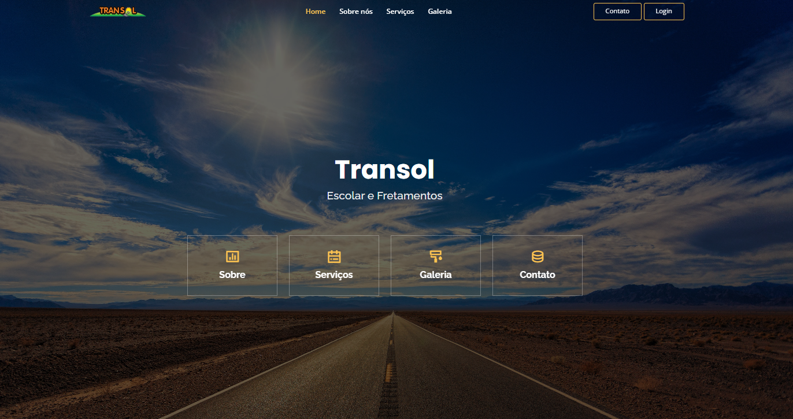
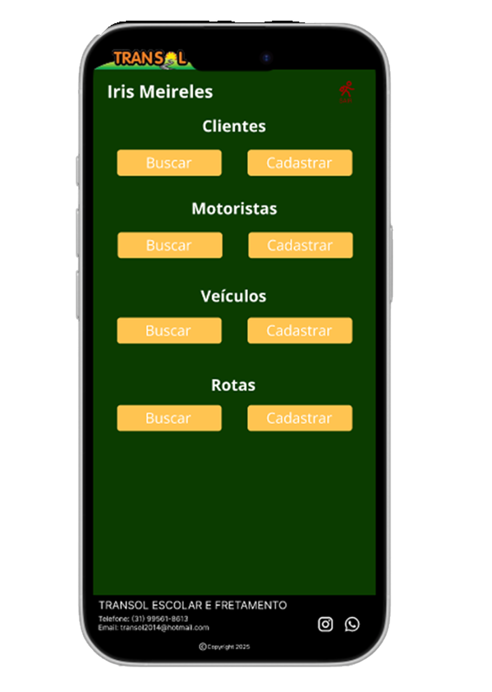
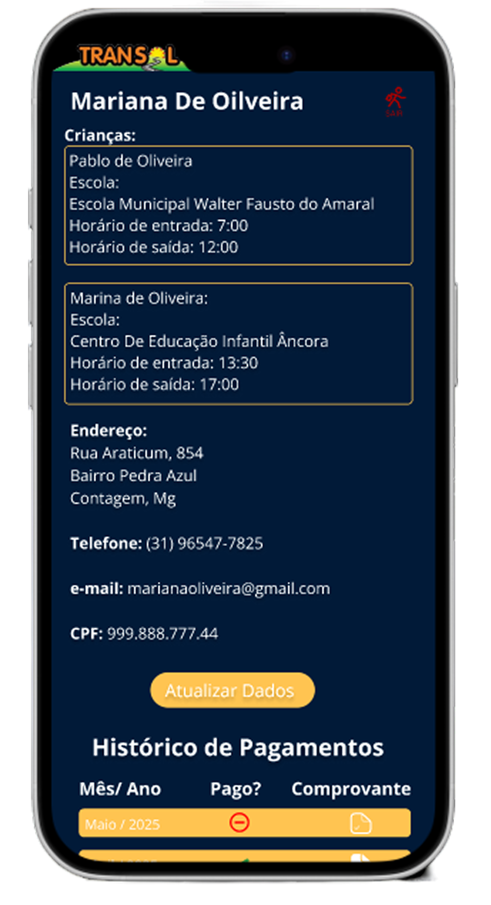
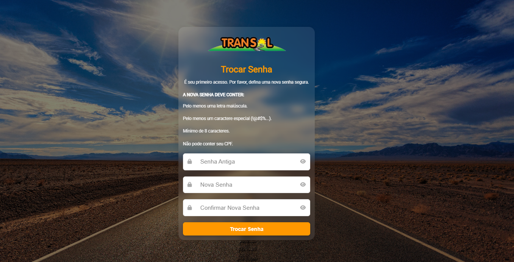
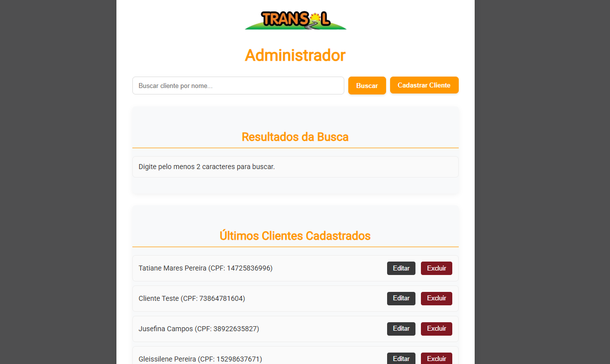
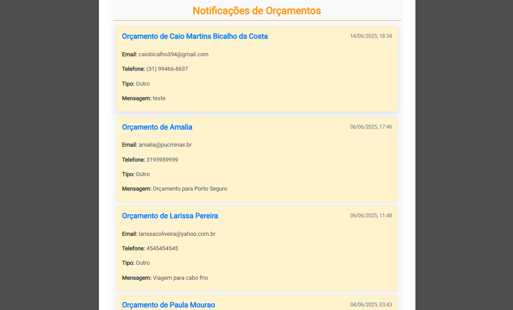
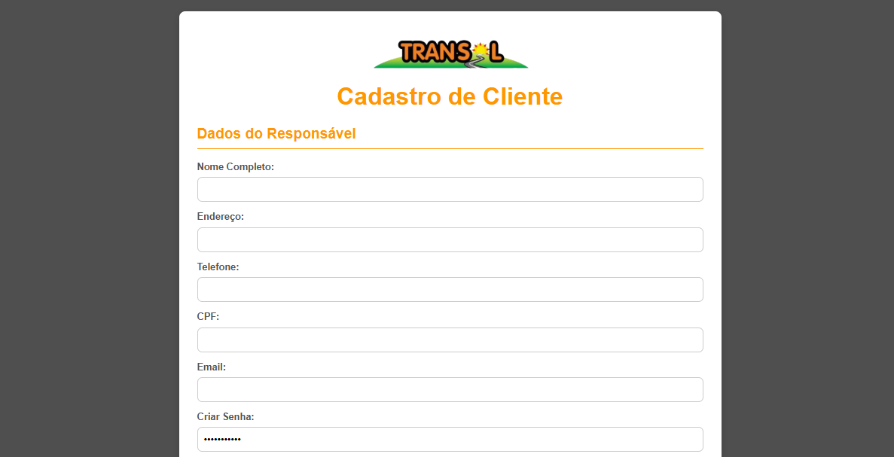
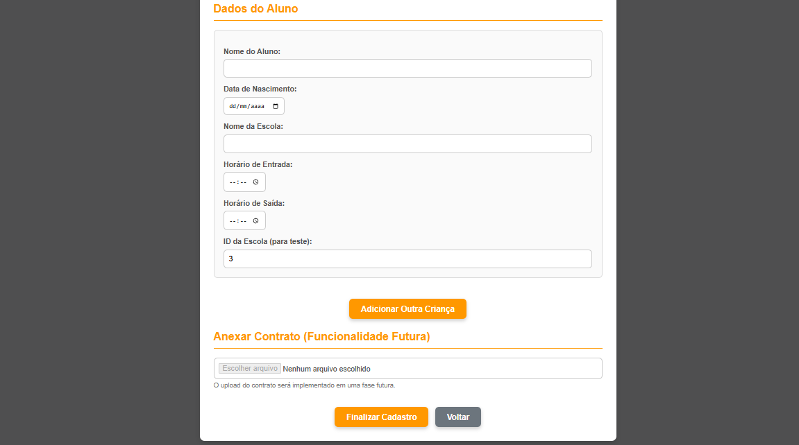
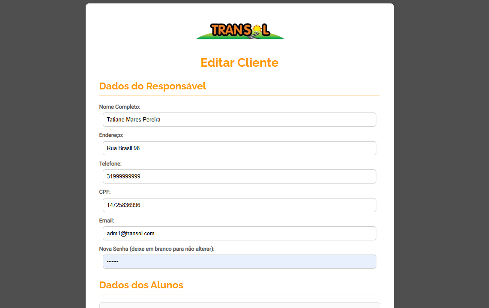
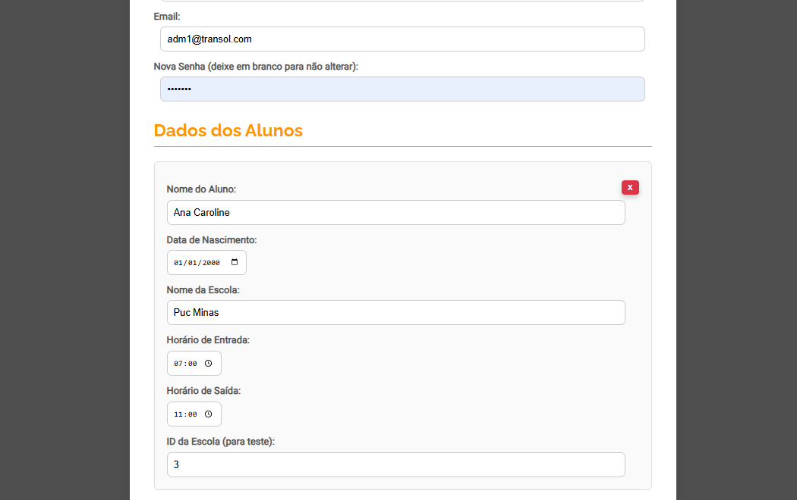

# Projeto de interface

Pré-requisitos: <a href="02-Especificacao.md"> Especificação do projeto</a>

 ## User flow

O fluxo do usuário se divide em três, a partir de tipos de logins diferentes. São eles o administrador do sistema, o cliente e o motorista, Cada um com suas telas e permissões pertinentes ao seu uso.

### Diagrama de fluxo
Este diagrama de fluxo representa o funcionamento do sistema da Transol, mostrando os caminhos que os diferentes perfis de usuários percorrem. Ele começa na tela de login, que direciona para três perfis: Cliente, Motorista e Administrador.

- O Cliente pode visualizar e atualizar dados, enviar comprovantes de pagamento e preencher formulários.
- O Motorista acessa suas rotas, visualiza veículos, adiciona quilometragem e registros de manutenção.
- O Administrador gerencia cadastros de clientes e motoristas, edita dados, cria rotas e atribui veículos.

Todos os fluxos convergem para o encerramento dos processos, representando a conclusão das atividades no sistema.

## Link para o protótipo interativo 

Segue o protótipo interativo feito no Figma

> - [protótipo interativo Transol](https://www.figma.com/proto/xlIznOchEOCRdWxV29P7ub/Transol?page-id=0%3A1&node-id=123-84&p=f&viewport=413%2C1042%2C0.25&t=ewmA8ZE3FgucOyes-1&scaling=scale-down&content-scaling=fixed&starting-point-node-id=1%3A2)
>

## Wireframes

### Home, Login e Contato

| Home | Login | Contato | 
|------|-------|---------|
|  |  |  |

---

###  ADM - Main - ADM - Busca, Editar Cliente, Editar Motorista e Editar Veículo

| ADM - Main | Busca | Editar Cliente | Editar Motorista | Editar Veículo |
|-------|----------------|------------------|----------------|----------------|
| |  |  |  |  |

---

### ADM - Criar Rota, Cliente Perfil 1, Cliente Perfil 2 e Adicionar Comprovante

| Criar Rota | Cliente Perfil 1 | Cliente Perfil 2 | Adicionar Comprovante |
|-------------|-------------------|------------------|------------------------|
|  |  |  |  |

---

### Motorista/ADM - Main, Visualizar Rota, Dados do Veículo

| Motorista Main | Visualizar Rota | Dados do Veículo |  
|----------------|------------------|-------------------|
|  |  |  |  

## Interface do sistema

### Tela principal do sistema

A tela inicial do sistema Transol apresenta uma interface moderna e intuitiva, com foco na navegação clara e rápida. No topo, estão o logotipo da empresa e o menu principal com links para as seções "Home", "Sobre nós", "Serviços", "Galeria", além dos botões "Contato" e "Login". Ao centro, o nome da empresa e seu serviço principal ("Escolar e Fretamentos") são destacados sobre uma imagem de fundo que remete à estrada, simbolizando mobilidade e confiança. Abaixo, ícones com atalhos visuais direcionam o usuário para as principais funcionalidades do site, promovendo uma experiência acessível e organizada.

### Tela de Login

### Alterar a Senha

### Tela do Administrador

### Cadastro Cliente

### Editar Cliente

