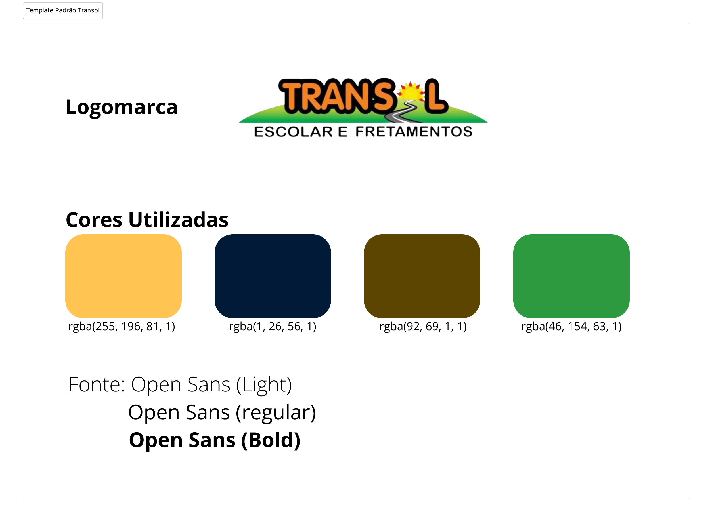

# Template padrão da aplicação

Pré-requisitos: <a href="02-Especificacao.md"> Especificação do projeto</a>, <a href="03-Metodologia.md"> Metodologia</a>, <a href="05-Projeto-interface.md"> Projeto de interface</a>

A imagem apresenta o Template Padrão Transol, que define a identidade visual do sistema Transol - Escolar e Fretamentos, servindo como referência para a padronização do design em todas as interfaces do sistema.

### Elementos do Template:
Logomarca: Centralizada no topo da imagem, a logomarca do Transol é composta pelo nome “TRANSOL” com elementos gráficos que remetem ao sol e à estrada, simbolizando o transporte e a mobilidade escolar. Abaixo, a descrição “ESCOLAR E FRETAMENTOS” reforça o ramo de atuação.

### Paleta de Cores Oficial:
Amarelo (rgba(255, 196, 81, 1)): Transmite energia, atenção e está associado à segurança, muito comum em contextos escolares.
Azul Escuro (rgba(1, 26, 56, 1)): Sugere confiabilidade e seriedade.
Marrom (rgba(92, 69, 1, 1)): Passa estabilidade e conexão com o campo e estradas.
Verde (rgba(46, 154, 63, 1)): Representa crescimento, tranquilidade e está vinculado ao ambiente e à sustentabilidade.

### Fonte Padrão: 
A tipografia adotada é a Open Sans, conhecida por sua legibilidade e estilo moderno, ideal para aplicações digitais.

#### ** Este template deve ser utilizado em todas as telas e materiais visuais do sistema Transol, garantindo uma comunicação coesa, clara e profissional com os usuários.
