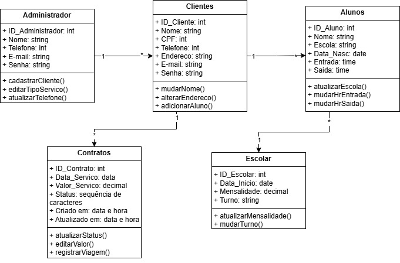
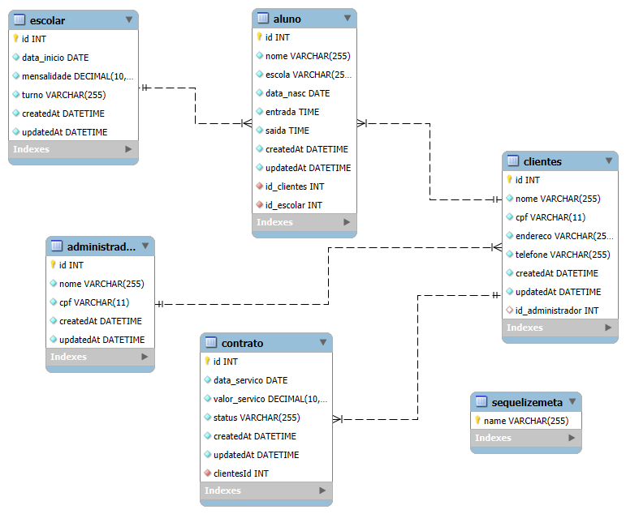

# Arquitetura da solução

<span style="color:red">Pré-requisitos: <a href="05-Projeto-interface.md"> Projeto de interface</a></span>

A plataforma será composta por uma aplicação web com frontend e backend separados. A arquitetura utiliza o modelo **cliente-servidor** e será acessada diretamente pelo navegador.

- O **frontend** será desenvolvido com **React**, utilizando **HTML**, **CSS** e **JavaScript**, e ficará hospedado na **Vercel**.
- O **backend** será implementado com **C# e .NET**, responsável por processar as regras de negócio do sistema, como cadastro de alunos, rotas, motoristas, veículos e agendamentos.
- O banco de dados utilizado será o **MySQL**, armazenando as informações essenciais da aplicação.
- As IDEs utilizadas no projeto serão o **Visual Studio Code** (frontend) e o **Visual Studio** (backend).

### Funcionalidades principais

- Cadastro e autenticação de usuários (pais/responsáveis, motoristas, administradores);
- Gestão de rotas, veículos, horários e agendamentos;
- Histórico de transporte por aluno;
- Integração com métodos de pagamento.
<div align="center">
    
</div>

## Diagrama de classes

O diagrama de classes ilustra graficamente a estrutura do software e como cada uma das classes estará interligada. Essas classes servem de modelo para materializar os objetos que serão executados na memória.


 


##  Modelo de dados

O desenvolvimento da solução proposta pela Transol Escolar e Fretamento requer a existência de bases de dados que permitam realizar o cadastro de dados e os controles associados aos processos identificados, assim como suas recuperações.

Utilizando a notação do DER (Diagrama Entidade-Relacionamento), foi elaborado um modelo que contempla todas as entidades e atributos associados às atividades dos processos identificados. Foi gerado um único DER que suporta todos os processos escolhidos, visando, assim, uma base de dados integrada. O modelo também contempla o controle de acesso dos usuários (partes interessadas nos processos) de acordo com os papéis definidos nos modelos do processo de negócio.

O modelo de dados é apresentado por meio de um modelo relacional que contempla todos os conceitos e atributos apresentados na modelagem dos processos.
### Modelo ER


### Esquema relacional



### Modelo físico

```sql
-- MySQL Script generated by MySQL Workbench
-- Wed Jun  4 12:52:34 2025
-- Model: New Model    Version: 1.0
-- MySQL Workbench Forward Engineering

SET @OLD_UNIQUE_CHECKS=@@UNIQUE_CHECKS, UNIQUE_CHECKS=0;
SET @OLD_FOREIGN_KEY_CHECKS=@@FOREIGN_KEY_CHECKS, FOREIGN_KEY_CHECKS=0;
SET @OLD_SQL_MODE=@@SQL_MODE, SQL_MODE='ONLY_FULL_GROUP_BY,STRICT_TRANS_TABLES,NO_ZERO_IN_DATE,NO_ZERO_DATE,ERROR_FOR_DIVISION_BY_ZERO,NO_ENGINE_SUBSTITUTION';

-- -----------------------------------------------------
-- Schema mydb
-- -----------------------------------------------------
-- -----------------------------------------------------
-- Schema transol
-- -----------------------------------------------------

-- -----------------------------------------------------
-- Schema transol
-- -----------------------------------------------------
CREATE SCHEMA IF NOT EXISTS transol DEFAULT CHARACTER SET utf8mb4 COLLATE utf8mb4_0900_ai_ci ;
USE transol ;

-- -----------------------------------------------------
-- Table transol.administrador
-- -----------------------------------------------------
CREATE TABLE IF NOT EXISTS transol.administrador (
  id INT NOT NULL AUTO_INCREMENT,
  nome VARCHAR(255) NOT NULL,
  cpf VARCHAR(11) NOT NULL,
  createdAt DATETIME NOT NULL,
  updatedAt DATETIME NOT NULL,
  PRIMARY KEY (id),
  UNIQUE INDEX cpf (cpf ASC) VISIBLE)
ENGINE = InnoDB
AUTO_INCREMENT = 38
DEFAULT CHARACTER SET = utf8mb4
COLLATE = utf8mb4_0900_ai_ci;


-- -----------------------------------------------------
-- Table transol.clientes
-- -----------------------------------------------------
CREATE TABLE IF NOT EXISTS transol.clientes (
  id INT NOT NULL AUTO_INCREMENT,
  nome VARCHAR(255) NOT NULL,
  cpf VARCHAR(11) NOT NULL,
  endereco VARCHAR(255) NOT NULL,
  telefone VARCHAR(255) NOT NULL,
  createdAt DATETIME NOT NULL DEFAULT CURRENT_TIMESTAMP,
  updatedAt DATETIME NOT NULL DEFAULT CURRENT_TIMESTAMP,
  id_administrador INT NULL DEFAULT NULL,
  PRIMARY KEY (id),
  INDEX clientes_id_administrador_foreign_idx (id_administrador ASC) VISIBLE,
  CONSTRAINT clientes_id_administrador_foreign_idx
    FOREIGN KEY (id_administrador)
    REFERENCES transol.administrador (id)
    ON DELETE SET NULL
    ON UPDATE CASCADE)
ENGINE = InnoDB
AUTO_INCREMENT = 20
DEFAULT CHARACTER SET = utf8mb4
COLLATE = utf8mb4_0900_ai_ci;


-- -----------------------------------------------------
-- Table transol.escolar
-- -----------------------------------------------------
CREATE TABLE IF NOT EXISTS transol.escolar (
  id INT NOT NULL AUTO_INCREMENT,
  data_inicio DATE NOT NULL,
  mensalidade DECIMAL(10,0) NOT NULL,
  turno VARCHAR(255) NOT NULL,
  createdAt DATETIME NOT NULL,
  updatedAt DATETIME NOT NULL,
  PRIMARY KEY (id))
ENGINE = InnoDB
AUTO_INCREMENT = 6
DEFAULT CHARACTER SET = utf8mb4
COLLATE = utf8mb4_0900_ai_ci;


-- -----------------------------------------------------
-- Table transol.aluno
-- -----------------------------------------------------
CREATE TABLE IF NOT EXISTS transol.aluno (
  id INT NOT NULL AUTO_INCREMENT,
  nome VARCHAR(255) NOT NULL,
  escola VARCHAR(255) NOT NULL,
  data_nasc DATE NOT NULL,
  entrada TIME NOT NULL,
  saida TIME NOT NULL,
  createdAt DATETIME NOT NULL,
  updatedAt DATETIME NOT NULL,
  id_clientes INT NOT NULL,
  id_escolar INT NOT NULL,
  PRIMARY KEY (id),
  INDEX aluno_id_clientes_foreign_idx (id_clientes ASC) VISIBLE,
  INDEX aluno_id_escolar_foreign_idx (id_escolar ASC) VISIBLE,
  CONSTRAINT aluno_id_clientes_foreign_idx
    FOREIGN KEY (id_clientes)
    REFERENCES transol.clientes (id)
    ON DELETE CASCADE
    ON UPDATE CASCADE,
  CONSTRAINT aluno_id_escolar_foreign_idx
    FOREIGN KEY (id_escolar)
    REFERENCES transol.escolar (id)
    ON DELETE RESTRICT
    ON UPDATE CASCADE)
ENGINE = InnoDB
AUTO_INCREMENT = 9
DEFAULT CHARACTER SET = utf8mb4
COLLATE = utf8mb4_0900_ai_ci;


-- -----------------------------------------------------
-- Table transol.contrato
-- -----------------------------------------------------
CREATE TABLE IF NOT EXISTS transol.contrato (
  id INT NOT NULL AUTO_INCREMENT,
  data_servico DATE NOT NULL,
  valor_servico DECIMAL(10,0) NOT NULL,
  status VARCHAR(255) NOT NULL,
  createdAt DATETIME NOT NULL,
  updatedAt DATETIME NOT NULL,
  clientesId INT NOT NULL,
  PRIMARY KEY (id),
  INDEX contrato_clientesId_foreign_idx (clientesId ASC) VISIBLE,
  CONSTRAINT contrato_clientesId_foreign_idx
    FOREIGN KEY (clientesId)
    REFERENCES transol.clientes (id)
    ON DELETE CASCADE
    ON UPDATE CASCADE)
ENGINE = InnoDB
AUTO_INCREMENT = 7
DEFAULT CHARACTER SET = utf8mb4
COLLATE = utf8mb4_0900_ai_ci;


-- -----------------------------------------------------
-- Table transol.sequelizemeta
-- -----------------------------------------------------
CREATE TABLE IF NOT EXISTS transol.sequelizemeta (
  name VARCHAR(255) COLLATE 'utf8mb3_unicode_ci' NOT NULL,
  PRIMARY KEY (name),
  UNIQUE INDEX name (name ASC) VISIBLE)
ENGINE = InnoDB;


SET SQL_MODE=@OLD_SQL_MODE;
SET FOREIGN_KEY_CHECKS=@OLD_FOREIGN_KEY_CHECKS;
SET UNIQUE_CHECKS=@OLD_UNIQUE_CHECKS;

```


## Tecnologias

| **Dimensão**    | **Tecnologia**                          |
|-----------------|------------------------------------------|
| Front-end       | HTML, CSS, JavaScript,             |
| Back-end        | C#, .NET                                 |
| SGBD            | MySQL                                    |
| IDEs            | Visual Studio Code, Visual Studio        |
| Deploy          | Vercel                                   |


## Hospedagem

A aplicação está totalmente hospedada na Vercel, incluindo tanto o frontend (desenvolvido com HTML, CSS, JavaScript e React) quanto o backend (desenvolvido com .NET e C#).

A Vercel permite deploy contínuo diretamente do repositório no GitHub, facilitando o desenvolvimento, atualização e publicação do sistema de forma rápida e confiável.

O banco de dados utilizado é o MongoDB, hospedado na nuvem através do MongoDB Atlas, garantindo alta disponibilidade, escalabilidade e segurança para o armazenamento das informações do sistema.

## Qualidade de Software

No desenvolvimento do sistema de transporte escolar e fretamento, foram priorizados os seguintes pontos de qualidade:

- **Manutenção fácil:**  
  O sistema será feito de forma organizada, com o código separado por partes. Isso ajuda na hora de corrigir erros, adicionar novas funções ou mudar algo no futuro sem quebrar o resto.

- **Boa usabilidade:**  
  A ideia é que qualquer pessoa consiga usar o sistema sem precisar de ajuda. Tudo será claro, direto e funcional — tanto em computador quanto no celular.

- **Segurança dos dados:**  
  Como o sistema lida com informações pessoais (alunos, pais, motoristas), tudo será tratado com cuidado. As informações ficarão protegidas contra acessos indevidos.

- **Funcionamento estável:**  
  O sistema precisa estar sempre disponível, principalmente nos horários de entrada e saída da escola. A estabilidade vai garantir que ninguém fique sem acesso quando mais precisa.

- **Acesso em qualquer lugar:**  
  O sistema será compatível com diferentes dispositivos e navegadores. Assim, o usuário consegue acessar de onde estiver, com praticidade e sem travamentos.

