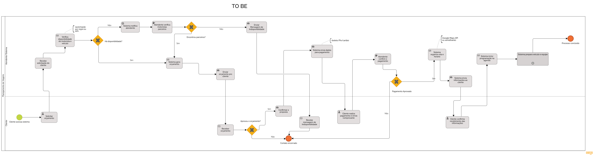

### Processo 2 – PLANEJAMENTO DE VIAGENS

Depois de analisar o processo atual (AS-IS), foi possível perceber que ele é totalmente manual, com várias trocas de mensagens no WhatsApp e etapas que exigem acompanhamento constante do atendente. Isso torna o atendimento mais demorado, aumenta o risco de falhas (como esquecer uma confirmação ou errar no orçamento) e dificulta a organização das informações.

A proposta do novo processo (TO-BE) é automatizar essas etapas usando a tecnologia para oferecer mais agilidade e controle. O cliente continua entrando em contato pelo WhatsApp, mas já recebe um link com um formulário onde preenche os dados da viagem. A partir desse ponto, o sistema realiza todo o processo: verifica a disponibilidade de veículo e motorista, gera o orçamento automaticamente e envia para o cliente. Se aprovado, o sistema já fornece os dados para pagamento via PIX. Após a confirmação, o próprio sistema organiza a rota e horário, prepara a equipe e envia todas as informações ao cliente.

O atendente entra apenas em casos específicos, como quando o sistema não identifica o pagamento ou se não houver disponibilidade direta. Isso libera tempo para a equipe se concentrar em atendimentos estratégicos ou excepcionais.

#### Oportunidades de melhoria
- Atendimento mais rápido e com menos esforço manual.
- Redução de erros operacionais e retrabalho.
- Processo padronizado, com histórico organizado.
- Atendente disponível apenas quando necessário.
- Experiência mais fluida e profissional para o cliente.

#### Limites da solução
Se o pagamento não for identificado automaticamente, o atendente precisa intervir.

É necessário internet e um sistema funcional para operar o novo processo.

Algumas pessoas podem ter dificuldades com formulários e tecnologia.

#### Alinhamento com os objetivos do negócio
Esse novo processo ajuda o serviço de planejamento de viagens a crescer com mais agilidade, padronização e escalabilidade. Também melhora a comunicação, reduz o tempo de resposta e proporciona uma experiência mais organizada e moderna ao cliente.

#### Detalhamento das atividades

_Descreva aqui cada uma das propriedades das atividades do processo 2. 
Devem estar relacionadas com o modelo de processo apresentado anteriormente._

_Os tipos de dados a serem utilizados são:_

_* **Área de texto** - campo texto de múltiplas linhas_

_* **Caixa de texto** - campo texto de uma linha_

_* **Número** - campo numérico_

_* **Data** - campo do tipo data (dd-mm-aaaa)_

_* **Hora** - campo do tipo hora (hh:mm:ss)_

_* **Data e Hora** - campo do tipo data e hora (dd-mm-aaaa, hh:mm:ss)_

_* **Imagem** - campo contendo uma imagem_

_* **Seleção única** - campo com várias opções de valores que são mutuamente exclusivas (tradicional radio button ou combobox)_

_* **Seleção múltipla** - campo com várias opções que podem ser selecionadas mutuamente (tradicional checkbox ou listbox)_

_* **Arquivo** - campo de upload de documento_

_* **Link** - campo que armazena uma URL_

_* **Tabela** - campo formado por uma matriz de valores_

## Processo 2 – Planejamento de Viagens

### Atividade 1 – Preenchimento do Formulário de Viagem

| **Campo**             | **Tipo**         | **Restrições**                             | **Valor default** |
|-----------------------|------------------|--------------------------------------------|-------------------|
| Nome do responsável   | Caixa de Texto   | Obrigatório                                | —                 |
| CPF                   | Caixa de Texto   | Formato CPF (000.000.000-00)               | —                 |
| Telefone              | Caixa de Texto   | Obrigatório – Formato (XX) XXXXX-XXXX      | —                 |
| Local de partida      | Caixa de Texto   | Obrigatório                                | —                 |
| Destino               | Caixa de Texto   | Obrigatório                                | —                 |
| Data da viagem        | Data             | Obrigatório                                | —                 |
| Hora da viagem        | Hora             | Obrigatório                                | —                 |
| Quantidade de alunos  | Número           | Obrigatório                                | —                 |
| Observações           | Área de Texto    | Opcional                                   | —                 |

| **Comandos**           | **Destino**                     | **Tipo**  |
|------------------------|----------------------------------|-----------|
| Enviar formulário      | Verificar disponibilidade       | default   |
| Cancelar               | Fim do processo                 | cancel    |

---

### Atividade 2 – Verificar Disponibilidade de Veículo e Motorista

| **Campo**             | **Tipo**         | **Restrições** | **Valor default** |
|-----------------------|------------------|----------------|-------------------|
| Data da viagem        | Data             | —              | —                 |
| Hora da viagem        | Hora             | —              | —                 |
| Local de partida      | Caixa de Texto   | —              | —                 |
| Destino               | Caixa de Texto   | —              | —                 |

| **Comandos**             | **Destino**                    | **Tipo**  |
|--------------------------|---------------------------------|-----------|
| Recursos disponíveis     | Gerar orçamento                | default   |
| Recursos indisponíveis   | Fim do processo                | cancel    |

---

### Atividade 3 – Gerar Orçamento

| **Campo**         | **Tipo** | **Restrições** | **Valor default**       |
|-------------------|----------|----------------|-------------------------|
| Valor total       | Número   | Gerado automático | Calculado pelo sistema |

| **Comandos**       | **Destino**             | **Tipo**  |
|--------------------|--------------------------|-----------|
| Aceitar orçamento  | Enviar dados para PIX    | default   |
| Recusar orçamento  | Fim do processo          | cancel    |

---

### Atividade 4 – Pagamento

| **Campo**          | **Tipo** | **Restrições** | **Valor default**       |
|--------------------|----------|----------------|-------------------------|
| Chave PIX          | Link     | —              | Gerado pelo sistema     |

| **Comandos**         | **Destino**                        | **Tipo**  |
|----------------------|-------------------------------------|-----------|
| Pagamento efetuado   | Organização da viagem              | default   |
| Pagamento não identificado | Atendimento manual          | cancel    |

---

### Atividade 5 – Organização da Viagem

| **Campo**             | **Tipo**        | **Restrições**                             | **Valor default**           |
|-----------------------|-----------------|--------------------------------------------|-----------------------------|
| Rota atribuída        | Caixa de Texto  | Gerado automático                          | —                           |
| Veículo designado     | Caixa de Texto  | Gerado automático                          | —                           |
| Motorista responsável | Caixa de Texto  | Gerado automático                          | —                           |
| Horário da viagem     | Data e Hora     | Gerado automático                          | —                           |

| **Comandos**         | **Destino**           | **Tipo**  |
|----------------------|------------------------|-----------|
| Finalizar planejamento | Fim do processo      | default   |
| Cancelar              | Fim do processo       | cancel    |
